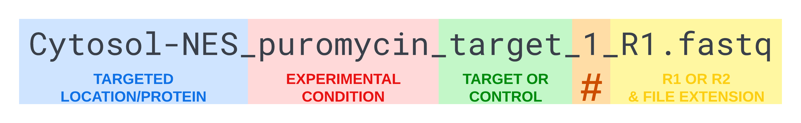

# Data Alignment for RNA-Seq Experiments

The TrimMapCount pipeline is designed to trim, map, and count FASTQ reads with 
[icSHAPE](https://github.com/qczhang/icSHAPE), [STAR](https://github.com/alexdobin/STAR), 
and [HTSeq](https://github.com/htseq/htseq).


## Setup

If you are not a member of the Fazal Lab and don't have access to Baylor College 
of Medicine's MHGCP cluster, follow this link to 
[download and setup the pipeline](https://fazallabbcm.github.io/TrimMapCount/DownloadAndSetup) 
on your local computing environment.

### Naming raw data files

Rename your raw FASTQ files so that each file name has these 5 things (in order and separated 
by underscores):

   1. **Targeted location/protein** (can't contain an underscore)
      * For an APEX-seq experiment, subcellular location where APEX is targeted and/or which protein the 
        enzyme is fused to
        > Note:
        > This pipeline is not exclusive to APEX-seq experiments. For a generic RNA-Seq experiment, 
        > replace the targeted location/protein with an experimental condition (see next list item).
   2. **Experimental condition or "none"** (can't contain an underscore)
      * Could be a time limit, cell type, antibiotic treatment, etc.
        > Note:
        > Need to label your data files with more experimental conditions? Just separate the extra conditions 
        > with a hyphen or period like this: `CellLine-TargetedProtein_DrugTreatment.TimeLimit_target_1.R1.fastq`. 
   3. **"target" or "control"** (first letter can be capitalized)
      * For an APEX-seq experiment, whether the targeted location was labeled by adding H<sub>2</sub>O<sub>2</sub> (target) or not (control)
        > Note:
        > The label "target" or "control" could mean something different depending on your experiment. If your  
        > file was named `HEK293.PloyA_puromycin.1min_target_1.R1.fastq`, the "target" could be treated with puromycin 
        > for 1 minute and the "control" not treated with puromycin. Alternatively, the "target" could be 
        > polyadenylated RNA with non polyadenylated RNA as the "control", or the "target" could be HEK293 
        > cells with HepG2 cells as the "control". Decide what "target" and "control" mean for your experiment, 
        > and write it down.
   4. **A number to indicate which target or control sample** (one digit 0-9)
   5. **"R1.fastq" or "R2.fastq"** (or "R1.fastq.gz" and "R2.fastq.gz" for zipped files)


### Sorting raw data files

To save lots of time, separate your FASTQ files into subfolders for each unique combination 
of targeted location/protein and experimental condition (like the picture below). This will allow 
you to run the TrimMapCount pipeline for each subfolder of raw data simultaneously.


## Running the Pipeline

1. From the command line, add the TrimMapCount scripts folder to your PATH environment variable. 
   For Fazal Lab members, this can be done with the following code:
   ```
   export PATH=/storage/fazal/pipelines/TrimMapCount/scripts:"${PATH}"
   ```
   
2. Repeat steps 3 and 4 for each subfolder in your experiment's raw data folder.
   
3. Run the following code (replacing the file paths with the paths to your experiment's 
   raw data and processed data subfolders):
   ```
   TrimMapCount -r /path/to/rawdata/location_condition -d /path/to/data/location_condition
   ```

4. Make sure that the raw data and processed data file paths are correct. Then enter "y" to 
   start the pipeline.


## What next?

You can check the log file in your processed data folder to see the progress of your job as it runs.

If you encounter any errors, see our 
[troubleshooting](https://fazallabbcm.github.io/TrimMapCount/Troubleshooting) page for help.

Once TrimMapCount has finished, you will have all of the data files necessary for the 
[ProcessCounts](https://fazallabbcm.github.io/ProcessCounts) and 
[BamToBigWig](https://fazallabbcm.github.io/BamToBigWig) pipelines.
